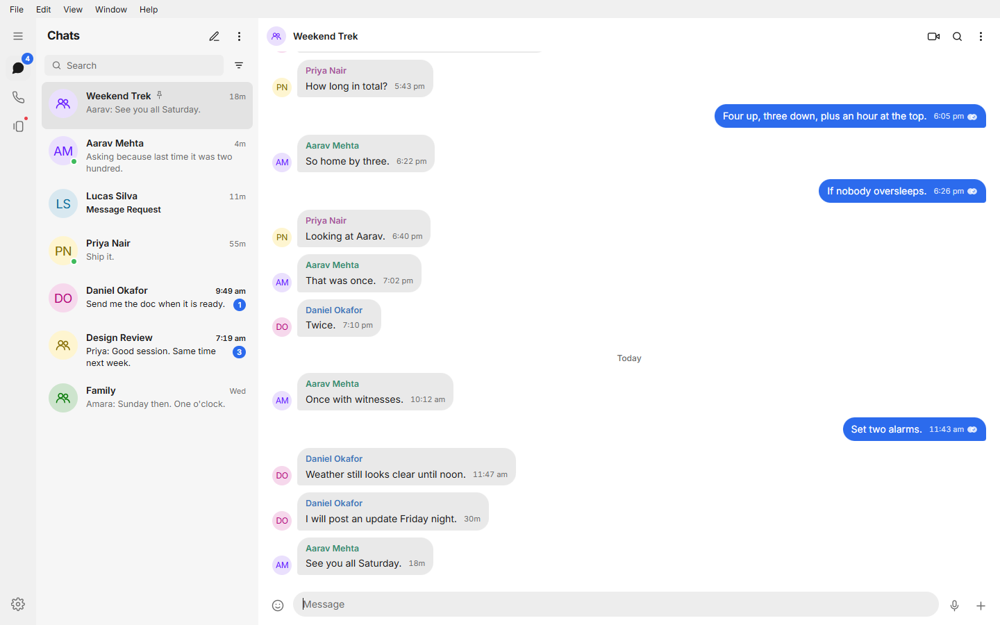
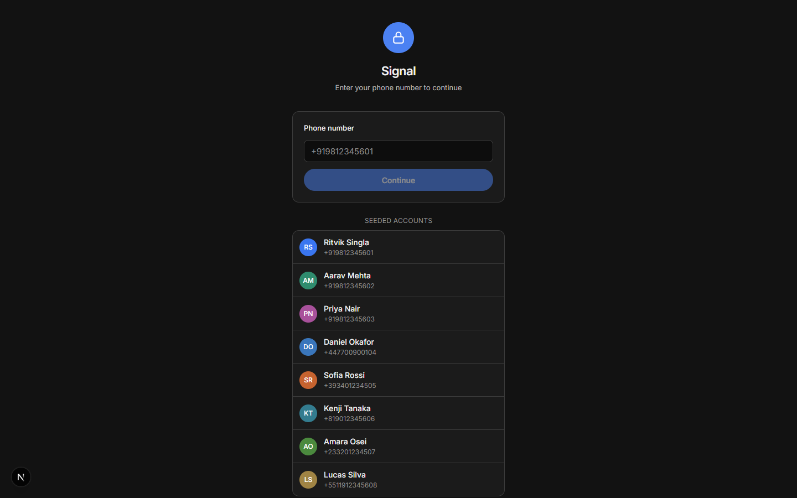
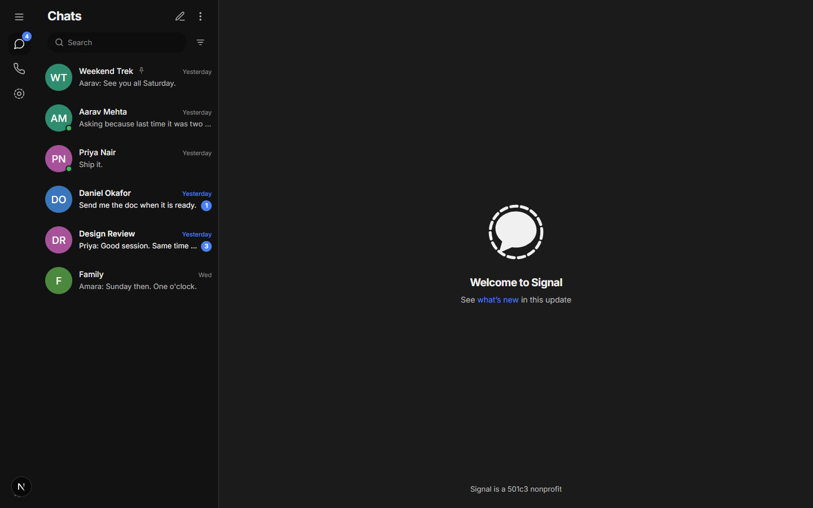
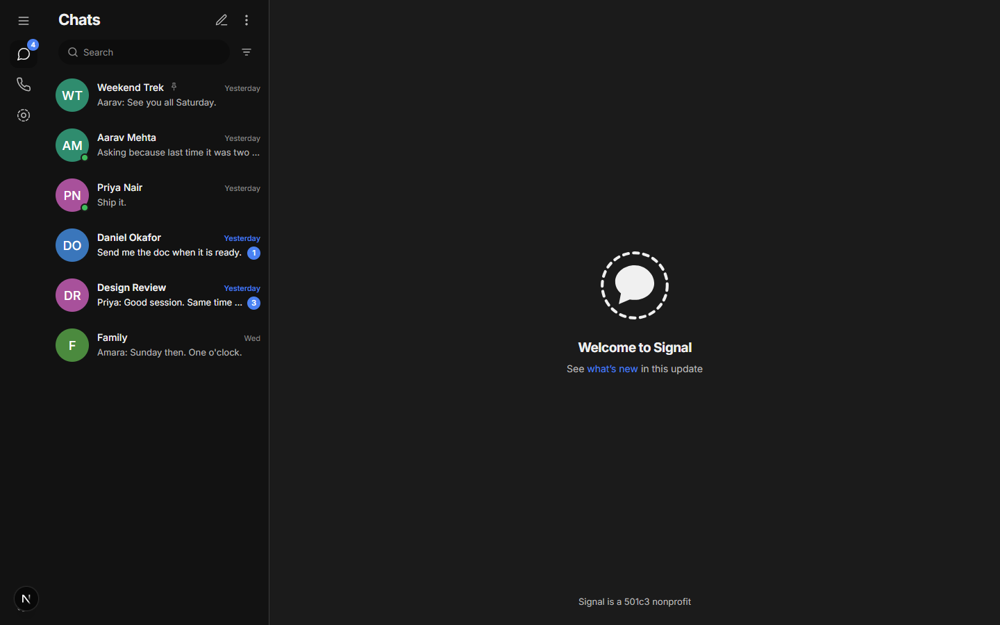
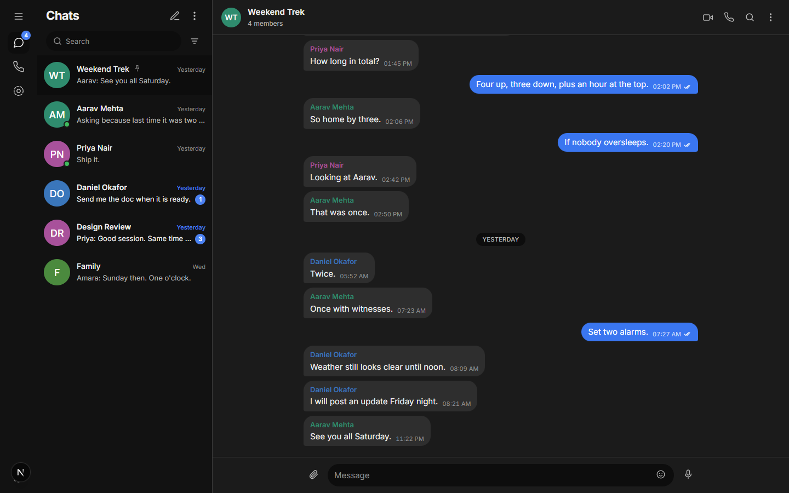
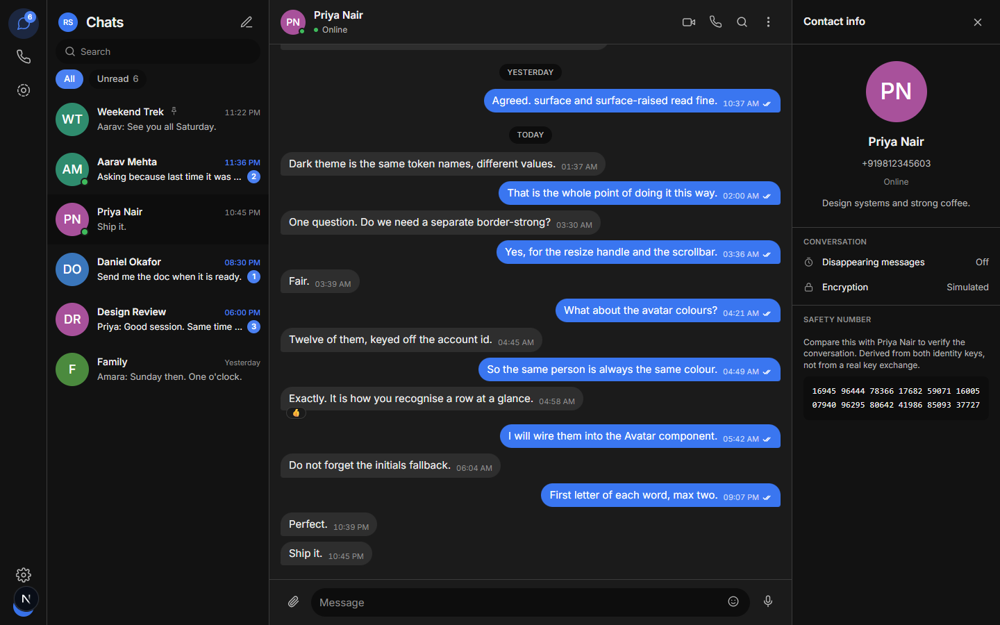
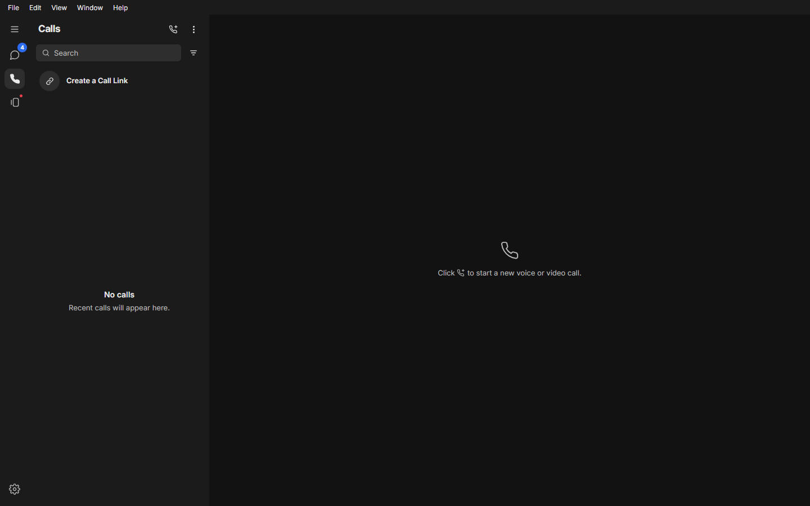
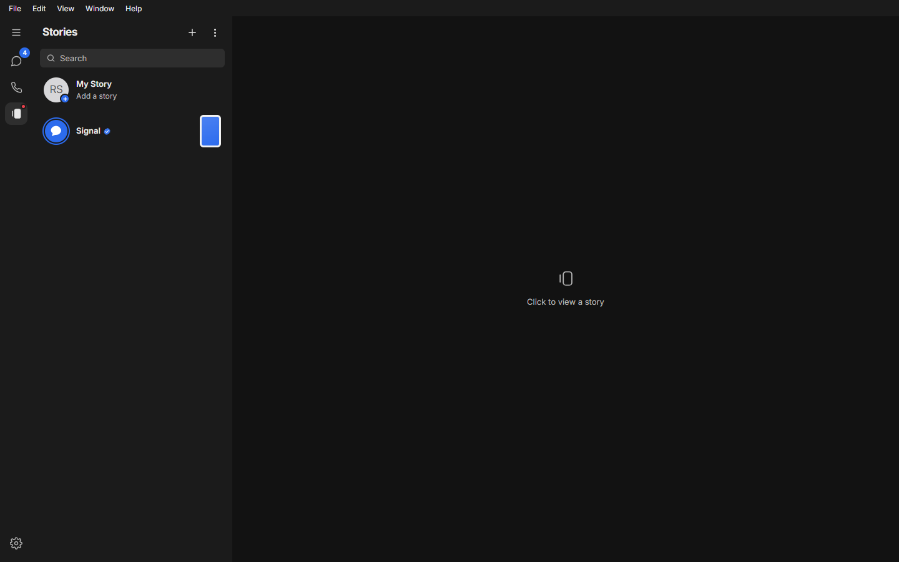
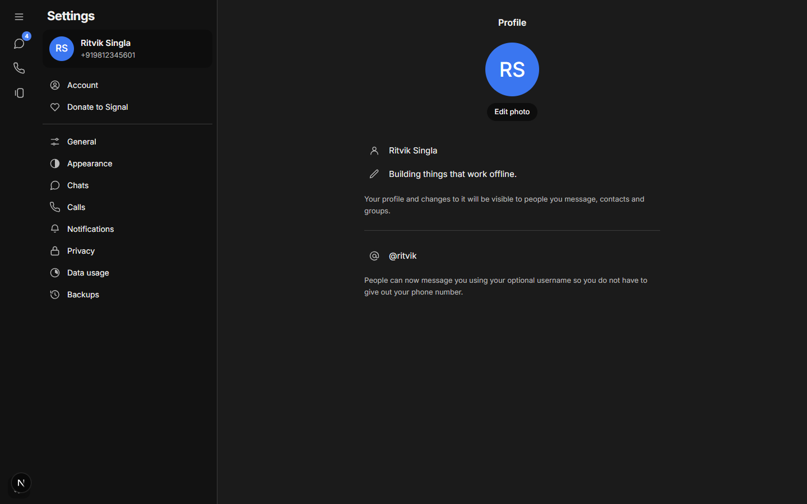
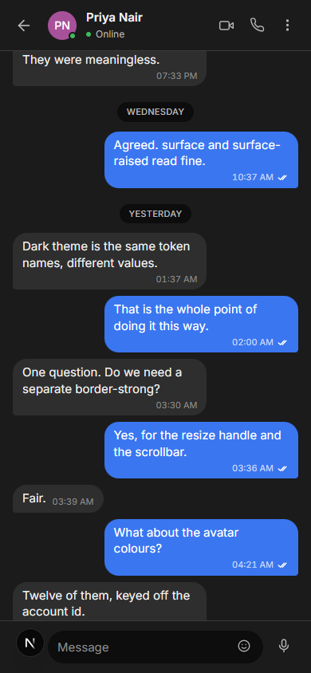

# Signal Clone

A secure-messaging platform that reproduces Signal's layout, conversation model
and real-time behaviour. Built for the Scaler SDE Fullstack assignment.

Encryption is **simulated**, as the brief permits. Everything else is real:
messages persist, receipts are tracked per recipient, and the conversation
model is the same object for direct threads and groups.



---

## Status

Phases 0 through 3 complete, plus the frontend shell. Full build sequence in
[`docs/PLAN.md`](docs/PLAN.md); a narrative walkthrough suitable for handing to
someone else is in [`docs/Signal-Clone-Walkthrough.pdf`](docs/Signal-Clone-Walkthrough.pdf).

| Phase | Area | State |
| ----- | ---- | ----- |
| 00 | Scaffold | Done |
| 01 | Data layer, migration, seed | Done |
| 02 | Authentication | Done |
| 03 | Conversations and messages | Done |
| 04 | Realtime WebSocket hub | Done |
| 05 | Frontend shell and Signal UI | Done |
| 06 | Onboarding polish | Partly done |
| 07 | Conversation list extras | Partly done |
| 08 | Chat pane: typing, live receipts | Done |
| 09 | Group admin UI | Partly done |
| 10 | Settings and placeholders | Done |
| 11 | Bonus: attachments, disappearing | Partly done: attachments, pin, forward, delete for me; disappearing sweep not started |
| 12 | Documentation and deploy | Not started |

Messaging is live: two tabs on different accounts exchange messages, typing
indicators and read receipts with no refresh. What remains is attachments,
disappearing-message sweeping, the group admin controls in the UI, and deploy.

---

## Tech stack

| Layer | Choice | Why |
| ----- | ------ | --- |
| Frontend | Next.js 16, React 19, TypeScript, Tailwind v4 | Signal values live as CSS variables mapped into the Tailwind theme |
| State | Zustand | Small enough to explain in an interview, which the rubric tests |
| Backend | FastAPI, SQLAlchemy 2.0, Alembic | Native WebSocket with no extra broker, async ORM, migrations as reviewable history |
| Database | SQLite with WAL and FTS5 | Named by the brief. FTS5 gives message search without another service |
| Auth | JWT access plus rotating refresh | Access token in memory, refresh token server-side and revocable |

---

## Setup

### Backend

```bash
cd backend
python -m venv .venv
.venv\Scripts\activate          # Windows
# source .venv/bin/activate     # macOS and Linux
pip install -r requirements.txt

alembic upgrade head            # create the schema
python -m app.db.seed           # eight accounts, nine threads, 167 messages

uvicorn app.main:app --reload --port 8000
```

API on `http://localhost:8000`, interactive docs at `/docs`. No `.env` file is
needed locally; copy `.env.example` only to override something.

### Frontend

```bash
cd frontend
npm install
npm run dev
```

App on `http://localhost:3000`. The sign-in screen lists every seeded account
as a one-tap button and fills the verification code for you.

### Verifying it works

```bash
# with both servers running
python backend/scripts/smoke_test.py          # 44 REST checks
python backend/scripts/realtime_test.py       # 20 socket checks, two accounts
python backend/scripts/actions_test.py        # 20 checks: pin, forward, delete for me, info, uploads
node frontend/scripts/two-tab-test.mjs out/   # the live gate, in two real browsers
node frontend/scripts/video-walkthrough.mjs out/                    # screens from reference video 1
node frontend/scripts/message-actions-walkthrough.mjs out/ files/   # video 2 + attachments
node frontend/scripts/screenshots.mjs out/    # captures the UI in Chrome
```

---

## Architecture

```
signal-clone/
├── backend/
│   ├── app/
│   │   ├── api/v1/      routers: parse, delegate, return
│   │   ├── core/        settings, security, dependencies
│   │   ├── db/          engine, base, custom types, seed
│   │   ├── models/      SQLAlchemy tables
│   │   ├── schemas/     Pydantic request and response models
│   │   ├── services/    business rules, the only layer touching the ORM
│   │   ├── realtime/    hub, broadcast helpers, socket endpoint
│   │   └── main.py      application factory
│   ├── alembic/         migrations
│   └── scripts/         smoke_test.py
└── frontend/src/
    ├── app/             App Router entry
    ├── components/      ui, shell, conversations, chat, auth
    ├── hooks/           useSocket
    ├── lib/             api client, endpoints, types, formatting, theme, socket
    └── store/           session and chat slices
```

**The layering rule.** Routers parse and validate, then call a service.
Services hold the rules and are the only layer that touches the ORM. The
realtime hub will be a transport, not a decision maker: it broadcasts what a
service already committed.

**The life of a message.** The composer appends an optimistic bubble keyed by
a client-generated id. A POST persists the row and returns the server id; the
optimistic bubble reconciles on that key, so a retry cannot duplicate. Each
recipient's receipt row is created up front, so delivery and read only ever
update rows rather than racing to insert them.

---

## Database schema

Eleven tables. Column-level detail is in the walkthrough PDF.

| Table | Holds |
| ----- | ----- |
| `users` | One row per account: identity, profile, presence |
| `devices` | Backs the Linked Devices screen |
| `contacts` | Directed address book, a self-join on users |
| `conversations` | One object for both direct and group threads |
| `conversation_members` | Membership, role, read cursor, per-person preferences |
| `messages` | The thread. Soft deleted, never hard deleted |
| `message_receipts` | Per-recipient delivery and read truth |
| `reactions` | One emoji per person per message |
| `attachments` | Files and images hung off a message |
| `auth_sessions` | Refresh token store, makes logout real |
| `phone_verifications` | The mocked OTP flow, modelled as if it were real |

Three decisions drive the shape:

1. **A conversation is the same object** whether it holds two people or twenty.
   A `type` column distinguishes them, and a sorted-pair `dm_key` with a unique
   index enforces one direct thread per pair.
2. **Read state belongs to the membership**, not the message. Each membership
   holds a `last_read_message_id` cursor and the unread count is derived from
   it, so opening a thread is a single-row update no matter how many messages
   were unread.
3. **A receipt is per recipient**, because a group message is delivered many
   times. The cursor answers "what has this person read"; the receipt answers
   "who has received this specific message". Conflating them produces wrong
   check marks in groups.

### Indexes and constraints

| Purpose | Definition |
| ------- | ---------- |
| Thread paging | `messages (conversation_id, created_at)` |
| Idempotent send | `UNIQUE messages (sender_id, client_id)` |
| List sort | `conversations (last_activity_at)` |
| One direct thread per pair | `UNIQUE conversations (dm_key)` |
| One membership per person | `UNIQUE conversation_members (conversation_id, user_id)` |
| One receipt per recipient | `UNIQUE message_receipts (message_id, user_id)` |
| One reaction per person | `UNIQUE reactions (message_id, user_id)` |
| Disappearing sweeper | `messages (expires_at) WHERE expires_at IS NOT NULL` |
| Message search | FTS5 virtual table over `messages.body`, synced by trigger |
| Pragmas | `journal_mode=WAL`, `foreign_keys=ON`, `busy_timeout=5000` |

WAL matters because the default rollback journal blocks readers during a
write, which would be felt once a socket is broadcasting while messages are
being inserted.

---

## API overview

REST under `/api/v1`. Thirty-six routes; the OpenAPI page at `/docs` is
generated from the same Pydantic models the handlers use.

| Area | Routes |
| ---- | ------ |
| Meta | `GET /health`, `GET /api/v1/ping` |
| Auth | request-code, verify, register, refresh, logout, me, demo-accounts |
| Profile | `PATCH /users/me`, `GET /users/search`, `GET /users/{id}/safety-number` |
| Contacts | list, add, update, delete |
| Conversations | list, create direct, create group, detail, update, prefs, read |
| Membership | add, change role, remove, leave |
| Messages | list (cursor paged), send, edit, delete, react, search |

### Notable behaviours

- **Cursor pagination, not offset.** An offset shifts underneath you when a
  message arrives mid-scroll, so page two would repeat or skip a row.
- **Idempotent send.** The client generates `client_id` before the request
  leaves the browser; a unique index on `(sender_id, client_id)` makes a retry
  return the existing row rather than creating a second.
- **404 rather than 403** for a thread you are not in, so the API never
  confirms the existence of a conversation you cannot see.
- **Soft delete.** The row stays so the thread can render a tombstone, but the
  body never leaves the server again.

---

## Realtime

One socket per tab at `/ws`, authenticated with the same access token the REST
calls use. The hub maps an account id to a *set* of sockets, so one account
open in several tabs behaves the way Signal behaves across several devices.

| Direction | Frames |
| --------- | ------ |
| Client sends | `ping`, `typing.start`, `typing.stop`, `message.delivered` |
| Server sends | `connected`, `pong`, `message.new`, `message.updated`, `message.status`, `typing`, `presence`, `conversation.updated`, `error` |

Four things make it survive real conditions:

- **The socket carries no authority.** Every frame is re-checked against the
  database before it acts. Claiming to type in a thread you are not a member
  of is silently dropped.
- **Persist, then broadcast.** Never both at once. If the write fails nothing
  was announced; if the broadcast fails the message is still in the database.
- **Replay by refetch on reconnect.** Rather than buffering frames server-side,
  the client refetches the list and the open thread when the socket resumes.
  Simpler, and always correct.
- **Heartbeat and backoff.** A ping every 25 seconds, and reconnection with
  exponential backoff plus jitter so every open tab does not retry in lockstep.

## Screenshots

| | |
| --- | --- |
|  |  |
|  |  |
|  |  |

Calls, Stories and Settings are full two-pane screens rather than a single
blank placeholder, because that is how the real app lays them out:

| | |
| --- | --- |
|  |  |



Mobile layout at 390px:



---

## Design notes

Signal values are held as CSS variables in `frontend/src/app/globals.css` and
mapped into the Tailwind theme, so components write `bg-surface` or
`text-ink-2` and the dark theme is a token swap rather than a second set of
classes. The dark theme is defined twice on purpose: once behind a
`data-theme` attribute for the settings toggle, once behind
`prefers-color-scheme` for the operating system default, so the toggle can
override the OS in both directions.

| Metric | Value |
| ------ | ----- |
| Typeface | Inter, the face Signal Desktop ships |
| Navigation rail | 64px: hamburger, Chats, Calls, Stories, settings gear pinned to the bottom |
| Conversation list | 340px. Title left, compose and overflow right, unread filter beside the search field |
| Thread width | 720px, centred |
| Row height | 72px |
| Bubble radius | 18px, dropping to 4px on the tail corner of a run |
| Check marks | One outline sent, two outline delivered, two filled read |
| Dark theme | One near-black shared by the rail, list and thread, separated by hairlines |

---

## Assumptions

- Phone verification is mocked with a fixed code. In development the code is
  returned in the response body and pre-filled, so a reviewer never has to
  guess it.
- Encryption is simulated. Each account carries a random identity key, each
  message a derived envelope hash, and the contact sheet shows a 60-digit
  safety number built from both keys. There is no key agreement and no
  ratchet, and message bodies are plaintext at rest.
- Online and last-seen state is driven by real socket connect and disconnect
  rather than a random generator.
- The hub holds its connections in process memory. That is correct for this
  deployment, which is a single web service, but a multi-process deployment
  would need the sockets backed by a shared broker.

---

## Licence and originality

Written from scratch for this assignment. No existing Signal clone repository
was used as a source. The official Signal clients are GPL-licensed, so no code
was taken from them either.
