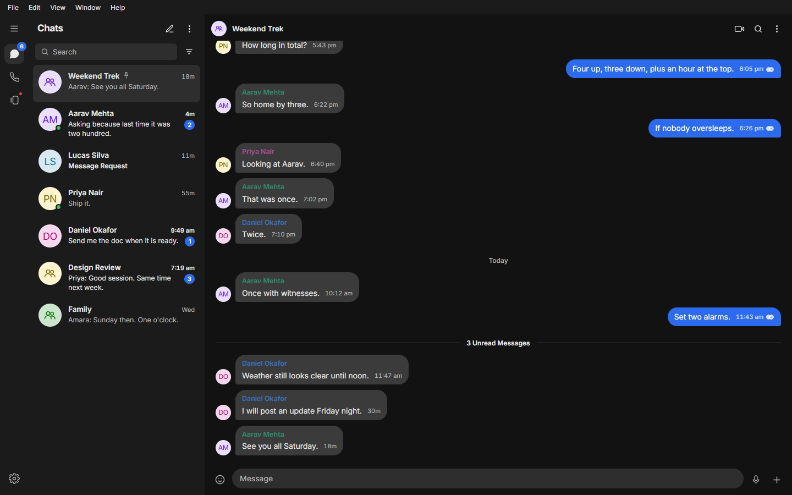
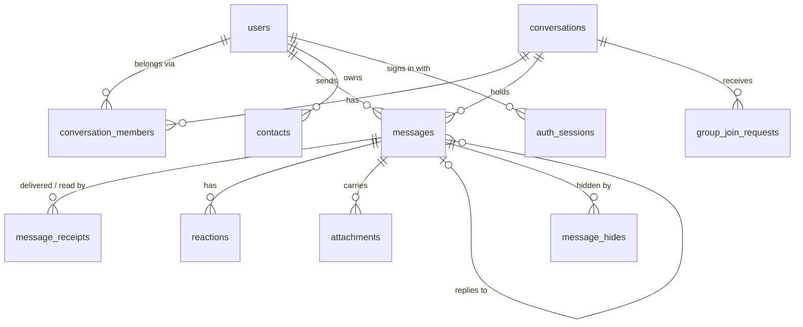
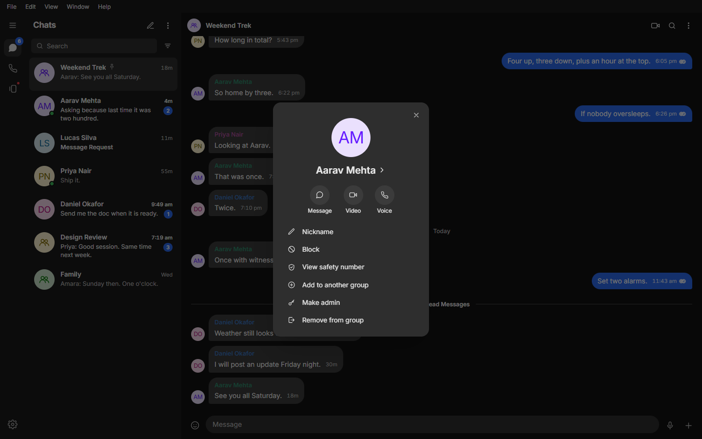
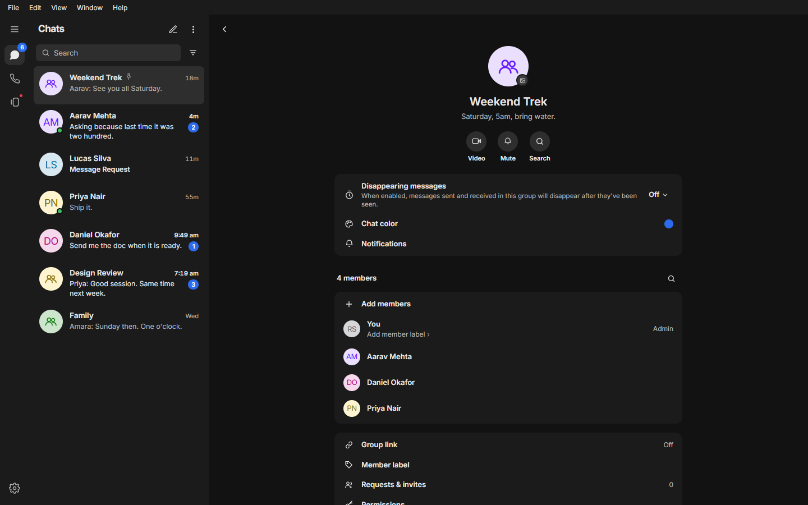
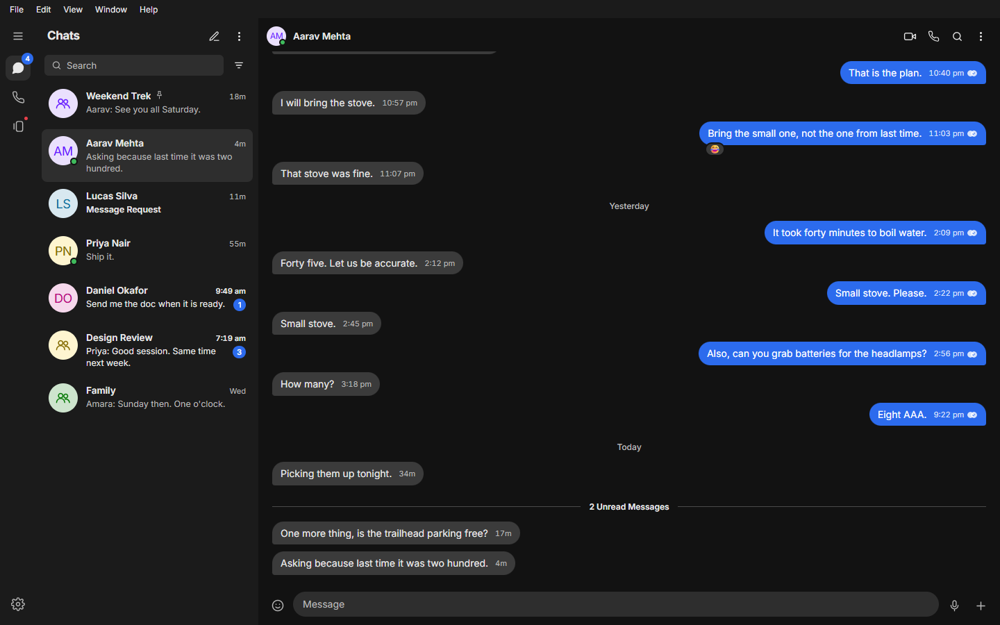
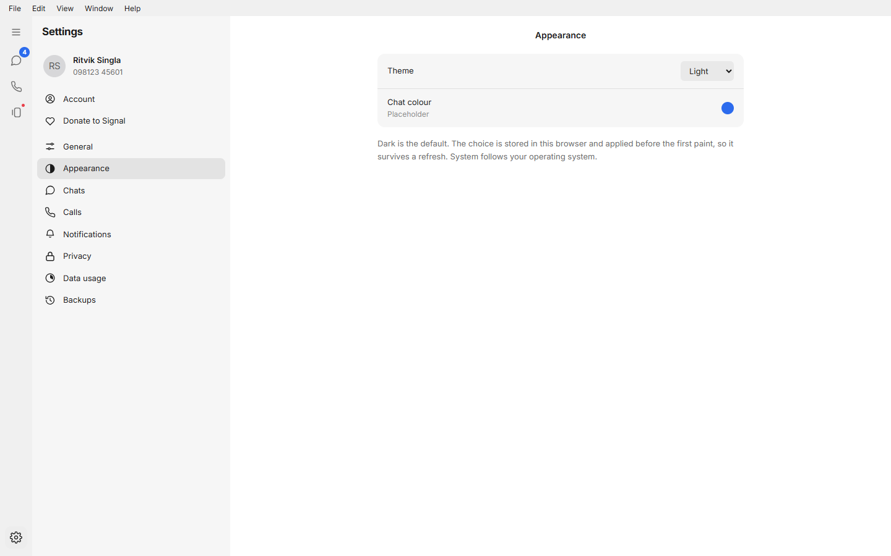
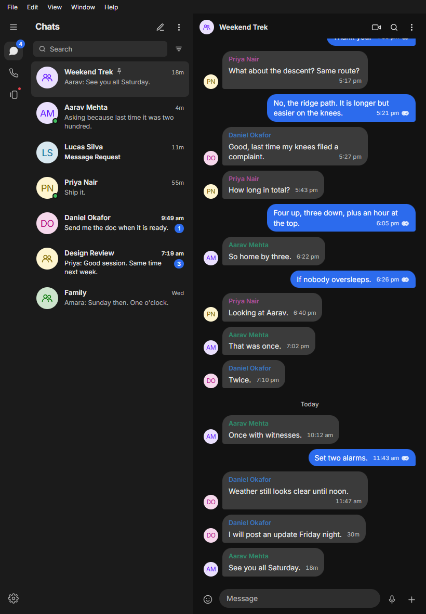
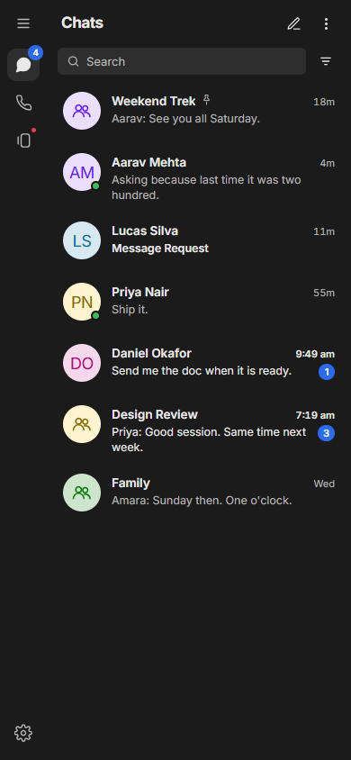
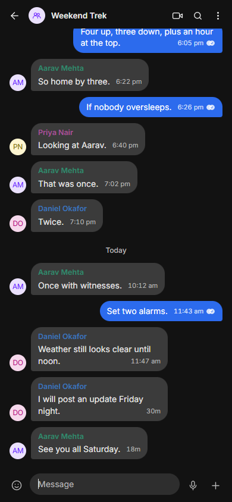

# Signal Clone

A secure-messaging platform that reproduces Signal's layout, conversation model
and real-time behaviour. Built for the Scaler SDE Fullstack assignment.

Encryption is **simulated**, as the brief permits. Everything else is real:
messages persist, receipts are tracked per recipient, and the conversation
model is the same object for direct threads and groups.



---

## Status

Every must-have and every bonus item in the brief is built and covered by an
automated check. The one deliverable left is the hosted demo.

| Brief | What is built |
| ----- | ------------- |
| Authentication / onboarding | Phone number plus fixed OTP (`123456`), display name and profile photo on the profile step, logout, session kept across reloads by a rotating httpOnly refresh cookie |
| Contacts and conversation list | List sorted by last activity, search across chats, contacts and message text, unread filter, Add contact from New chat, unread badges and previews, live online dot and last seen, message requests |
| One-to-one messaging | Live delivery over WebSocket, timestamps, sending / sent / delivered / read ticks, typing indicator, everything persisted |
| Group messaging | Create with name, photo, members and timer; members list; add, remove, make or remove admin; group link with approval; permissions; member labels; leave and end group |
| Signal experience | Rail, list and thread layout; Signal's bubbles, runs and sender avatars; modals for every confirmation; toasts; Settings with Privacy, Notifications, Appearance and more |
| Contact modal | A group member's avatar or name opens Signal's contact card: Message, Video, Voice, Nickname (first name, last name, note; only you see it), Block, View safety number, Add to another group, Make admin, Remove from group, and an About sheet with the Signal Connection explainer |
| Placeholders | Calls (lobby and call links, no media), Stories (kept on the device), Linked devices, simulated encryption with safety numbers |
| Bonus | Attachments and albums, voice notes, stickers, reactions, replies, forward, edit, pin, delete for me / everyone, disappearing messages, dark and light themes, phone / tablet / desktop layouts, keyboard shortcuts |

The build order and the reasoning behind each phase are in
[`docs/PLAN.md`](docs/PLAN.md); a narrative walkthrough is in
[`docs/Signal-Clone-Walkthrough.pdf`](docs/Signal-Clone-Walkthrough.pdf).

---

## Tech stack

| Layer | Choice | Why |
| ----- | ------ | --- |
| Frontend | Next.js 16, React 19, TypeScript, Tailwind v4 | Signal values live as CSS variables mapped into the Tailwind theme |
| State | Zustand | Small enough to explain in an interview, which the rubric tests |
| Backend | FastAPI, SQLAlchemy 2.0, Alembic | Native WebSocket with no extra broker, async ORM, migrations as reviewable history |
| Database | SQLite with WAL and FTS5 | Named by the brief. FTS5 gives message search without another service |
| Auth | JWT access plus rotating refresh | Access token in memory, refresh token server-side and revocable |

---

## Setup

### Backend

```bash
cd backend
python -m venv .venv
.venv\Scripts\activate          # Windows
# source .venv/bin/activate     # macOS and Linux
pip install -r requirements.txt

alembic upgrade head            # create the schema
python -m app.db.seed           # eight accounts, nine threads, 167 messages

uvicorn app.main:app --reload --port 8000
```

API on `http://localhost:8000`, interactive docs at `/docs`. No `.env` file is
needed locally; copy `.env.example` only to override something.

### Frontend

```bash
cd frontend
npm install
npm run dev
```

App on `http://localhost:3000`. The sign-in screen lists every seeded account
as a one-tap button and fills the verification code for you.

### Verifying it works

```bash
# with both servers running. Reseed before each browser walkthrough:
# each one changes the demo data the next one expects.
python backend/scripts/smoke_test.py          # 48 REST checks
python backend/scripts/realtime_test.py       # 20 socket checks, two accounts
python backend/scripts/actions_test.py        # 26 checks: pin, forward, delete for me, search, uploads, FTS integrity
python backend/scripts/groups_test.py         # 39 checks: group admin, link, permissions, disappearing messages
python backend/scripts/profile_test.py        # 21 checks: photos, contacts, nicknames, blocking
node frontend/scripts/two-tab-test.mjs out/   # the live gate, in two real browsers
node frontend/scripts/video-walkthrough.mjs out/                    # screens from reference video 1
node frontend/scripts/message-actions-walkthrough.mjs out/ files/   # video 2 + attachments
node frontend/scripts/media-search-walkthrough.mjs out/ files/      # videos 3 and 4
node frontend/scripts/groups-walkthrough.mjs out/                   # video 5: groups, disappearing
node frontend/scripts/profile-contacts-walkthrough.mjs out/ photo.jpg  # photos, contacts, blocking
node frontend/scripts/member-card-walkthrough.mjs out/              # video 6: contact modal, nickname
node frontend/scripts/screenshots.mjs docs/screenshots              # README images at three widths
```

---

## Architecture

```
signal-clone/
├── backend/
│   ├── app/
│   │   ├── api/v1/      routers: parse, delegate, return
│   │   ├── core/        settings, security, dependencies
│   │   ├── db/          engine, base, custom types, seed
│   │   ├── models/      SQLAlchemy tables
│   │   ├── schemas/     Pydantic request and response models
│   │   ├── services/    business rules, the only layer touching the ORM
│   │   ├── realtime/    hub, broadcast helpers, socket endpoint
│   │   └── main.py      application factory
│   ├── alembic/         migrations
│   └── scripts/         API and socket test suites
└── frontend/src/
    ├── app/             App Router entry
    ├── components/      ui, shell, conversations, chat, auth
    ├── hooks/           useSocket
    ├── lib/             api client, endpoints, types, formatting, theme, socket
    └── store/           session and chat slices
```

**The layering rule.** Routers parse and validate, then call a service.
Services hold the rules and are the only layer that touches the ORM. The
realtime hub is a transport, not a decision maker: it broadcasts what a
service already committed.

**Sessions.** The access token (30 minutes) lives in memory; the refresh
token is an httpOnly cookie that rotates on every use. Rotation makes each
refresh single-use, so the client never lets two refreshes race: one
in-flight refresh is shared by every caller, React's double-run boot effect
included. An API call that gets a 401 renews the token once and retries, and
the socket, which the server closes with code 1008 when it refuses a token,
renews before reconnecting. A tab left open for hours keeps working; a
revoked session signs out cleanly.

**The life of a message.** The composer appends an optimistic bubble keyed by
a client-generated id. A POST persists the row and returns the server id; the
optimistic bubble reconciles on that key, so a retry cannot duplicate. Each
recipient's receipt row is created up front, so delivery and read only ever
update rows rather than racing to insert them.

---

## Database schema

Thirteen tables plus an FTS5 index, built by the Alembic migrations in
`backend/alembic/versions`. Ids are UUID strings and timestamps are UTC.

| Table | Holds | Key columns | References |
| ----- | ----- | ----------- | ---------- |
| `users` | One row per account: identity, profile, presence | phone_number (unique), username (unique), display_name, about, avatar_url, avatar_color, identity_key, is_online, last_seen_at | |
| `auth_sessions` | Refresh token store, makes logout real | refresh_token_hash, user_agent, expires_at, revoked_at | users |
| `phone_verifications` | The mocked OTP flow, modelled as if it were real | phone_number, code, attempts, expires_at, consumed_at | |
| `devices` | Backs the Linked Devices screen | name, platform, is_primary, last_active_at | users |
| `contacts` | Directed address book, a self-join on users | nickname, nickname_family, note, is_blocked | owner → users, contact_user → users |
| `conversations` | One object for both direct and group threads | type, name, description, avatar_url, dm_key (unique), disappearing_seconds, last_activity_at, link_token, link_enabled, link_requires_approval, four `perm_*` columns, ended_at | created_by → users, last_message → messages |
| `conversation_members` | Membership, role, read cursor, per-person preferences | role, joined_at, left_at, last_read_message_id, muted_until, is_pinned, is_archived, label | conversations, users, messages |
| `messages` | The thread. Deletion for everyone is a soft delete; only expired disappearing messages are removed | type, body, event, client_id, envelope_hash, is_forwarded, edited_at, deleted_at, expires_at, pinned_at, pin_expires_at | conversations, sender → users, reply_to → messages, pinned_by → users |
| `message_receipts` | Per-recipient delivery and read truth | delivered_at, read_at | messages, users |
| `reactions` | One emoji per person per message | emoji | messages, users |
| `attachments` | Files and images hung off a message | file_name, content_type, size_bytes, storage_path, width, height, thumbnail_path | messages (null until sent), uploader → users |
| `message_hides` | Delete for me: a message hidden for one person only | | messages, users |
| `group_join_requests` | People waiting for admin approval after opening a group link | | conversations, users |



**Disappearing messages.** A message sent while a thread has a timer gets an
`expires_at`. A background task in the API process deletes expired rows
every two seconds (receipts, reactions and attachments go with them through
`ON DELETE CASCADE`, unshared files are removed from disk) and sends a
`message.expired` frame so open threads drop them live.

Three decisions drive the shape:

1. **A conversation is the same object** whether it holds two people or twenty.
   A `type` column distinguishes them, and a sorted-pair `dm_key` with a unique
   index enforces one direct thread per pair.
2. **Read state belongs to the membership**, not the message. Each membership
   holds a `last_read_message_id` cursor and the unread count is derived from
   it, so opening a thread is a single-row update no matter how many messages
   were unread.
3. **A receipt is per recipient**, because a group message is delivered many
   times. The cursor answers "what has this person read"; the receipt answers
   "who has received this specific message". Conflating them produces wrong
   check marks in groups.

### Indexes and constraints

| Purpose | Definition |
| ------- | ---------- |
| Thread paging | `messages (conversation_id, created_at)` |
| Idempotent send | `UNIQUE messages (sender_id, client_id)` |
| List sort | `conversations (last_activity_at)` |
| One direct thread per pair | `UNIQUE conversations (dm_key)` |
| One membership per person | `UNIQUE conversation_members (conversation_id, user_id)` |
| One receipt per recipient | `UNIQUE message_receipts (message_id, user_id)` |
| One reaction per person | `UNIQUE reactions (message_id, user_id)` |
| Disappearing sweeper | `messages (expires_at) WHERE expires_at IS NOT NULL` |
| Message search | FTS5 virtual table over `messages.body`, synced by trigger |
| Pragmas | `journal_mode=WAL`, `foreign_keys=ON`, `busy_timeout=5000` |

WAL matters because the default rollback journal blocks readers during a
write, which would be felt once a socket is broadcasting while messages are
being inserted.

---

## API overview

REST under `/api/v1`: 48 routes. The OpenAPI page at `/docs` is generated
from the same Pydantic models the handlers use.

| Area | Routes |
| ---- | ------ |
| Meta | `GET /health`, `GET /api/v1/ping` |
| Auth | `POST /auth/request-code`, `/auth/verify`, `/auth/register`, `/auth/refresh`, `/auth/logout`; `GET /auth/me`, `/auth/demo-accounts` |
| Profile | `PATCH /users/me` (name, about, photo), `GET /users/search`, `GET /users/{id}/safety-number` |
| Contacts | `GET` / `POST /contacts`, `PATCH /contacts/{id}` (nickname, note, block), `DELETE /contacts/{id}` |
| Conversations | `GET /conversations`, `POST /conversations/direct`, `POST /conversations/group`, `GET` / `PATCH /conversations/{id}`, `PATCH …/prefs` (mute, pin, archive), `POST …/read`, `POST …/clear` |
| Membership | `POST …/members`, `PATCH …/members/{user}` (role), `DELETE …/members/{user}`, `POST …/leave` |
| Group settings | `PATCH …/permissions`, `PATCH …/link`, `PUT …/label`, `POST …/requests/{user}`, `POST …/end` |
| Group link | `GET` / `POST /conversations/group-link/{token}`: preview, then join or ask to join |
| Messages | `GET` / `POST /conversations/{id}/messages` (cursor paged), `GET …/pins`, `PATCH` / `DELETE /messages/{id}`, `POST /messages/{id}/hide`, `GET /messages/{id}/info`, `PUT` / `DELETE /messages/{id}/pin`, `PUT` / `DELETE /messages/{id}/reaction`, `POST /messages/forward`, `GET /messages/search` |
| Attachments | `POST /attachments`: multipart upload; images get dimensions and a thumbnail |

### Notable behaviours

- **Cursor pagination, not offset.** An offset shifts underneath you when a
  message arrives mid-scroll, so page two would repeat or skip a row.
- **Idempotent send.** The client generates `client_id` before the request
  leaves the browser; a unique index on `(sender_id, client_id)` makes a retry
  return the existing row rather than creating a second.
- **404 rather than 403** for a thread you are not in, so the API never
  confirms the existence of a conversation you cannot see.
- **Soft delete.** The row stays so the thread can render a tombstone, but the
  body never leaves the server again.

---

## Realtime

One socket per tab at `/ws`, authenticated with the same access token the REST
calls use. The hub maps an account id to a *set* of sockets, so one account
open in several tabs behaves the way Signal behaves across several devices.

| Direction | Frames |
| --------- | ------ |
| Client sends | `ping`, `typing.start`, `typing.stop`, `message.delivered` |
| Server sends | `connected`, `pong`, `message.new`, `message.updated`, `message.status`, `message.expired`, `typing`, `presence`, `conversation.updated`, `error` |

Four things make it survive real conditions:

- **The socket carries no authority.** A refused token is closed with code
  1008 after the handshake, so the client can tell "renew the token" from
  "the network dropped". Every frame is re-checked against the
  database before it acts. Claiming to type in a thread you are not a member
  of is silently dropped.
- **Persist, then broadcast.** Never both at once. If the write fails nothing
  was announced; if the broadcast fails the message is still in the database.
- **Replay by refetch on reconnect.** Rather than buffering frames server-side,
  the client refetches the list and the open thread when the socket resumes.
  Simpler, and always correct.
- **Heartbeat and backoff.** A ping every 25 seconds, and reconnection with
  exponential backoff plus jitter so every open tab does not retry in lockstep.

## Screenshots

| | |
| --- | --- |
|  |  |
|  |  |
|  |  |

Calls, Stories and Settings are full two-pane screens rather than a single
blank placeholder, because that is how the real app lays them out:

| | |
| --- | --- |
|  |  |
|  |  |

Tablet (820px) and phone (390px). The list and the thread share the screen
when there is room, and become two screens with a back button when not:

| | | |
| --- | --- | --- |
|  |  |  |

---

## Design notes

Signal values are held as CSS variables in `frontend/src/app/globals.css` and
mapped into the Tailwind theme, so components write `bg-surface` or
`text-ink-2` and the dark theme is a token swap rather than a second set of
classes. The dark theme is defined twice on purpose: once behind a
`data-theme` attribute for the settings toggle, once behind
`prefers-color-scheme` for the operating system default, so the toggle can
override the OS in both directions.

| Metric | Value |
| ------ | ----- |
| Typeface | Inter, the face Signal Desktop ships |
| Navigation rail | 64px: hamburger, Chats, Calls, Stories, settings gear pinned to the bottom |
| Conversation list | 340px. Title left, compose and overflow right, unread filter beside the search field |
| Thread width | 720px, centred |
| Row height | 72px |
| Bubble radius | 18px, dropping to 4px on the tail corner of a run |
| Check marks | One outline sent, two outline delivered, two filled read |
| Dark theme | One near-black shared by the rail, list and thread, separated by hairlines |

---

## Assumptions

- Phone verification is mocked with a fixed code. In development the code is
  returned in the response body and pre-filled, so a reviewer never has to
  guess it.
- Encryption is simulated. Each account carries a random identity key, each
  message a derived envelope hash, and the contact sheet shows a 60-digit
  safety number built from both keys. There is no key agreement and no
  ratchet, and message bodies are plaintext at rest.
- Online and last-seen state is driven by real socket connect and disconnect
  rather than a random generator.
- Some preferences stay on the device, as Signal Desktop keeps them: theme,
  chat colours, per-chat notification options, "mark as unread", sticker
  packs you create, stories you post and call links. Nicknames and notes are
  stored on the server against your address book, so they follow the
  account, and the other person never sees them.
- Calls stop at the lobby: camera and microphone permission, the preview and
  call links work, but no media is exchanged.
- The hub holds its connections in process memory. That is correct for this
  deployment, which is a single web service, but a multi-process deployment
  would need the sockets backed by a shared broker.

---

## Licence and originality

Written from scratch for this assignment. No existing Signal clone repository
was used as a source. The official Signal clients are GPL-licensed, so no code
was taken from them either.
